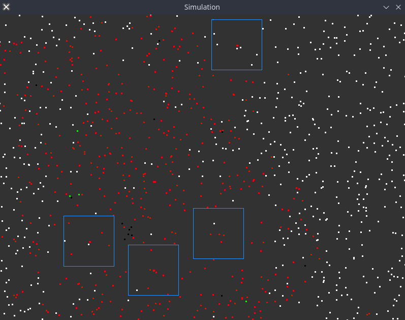
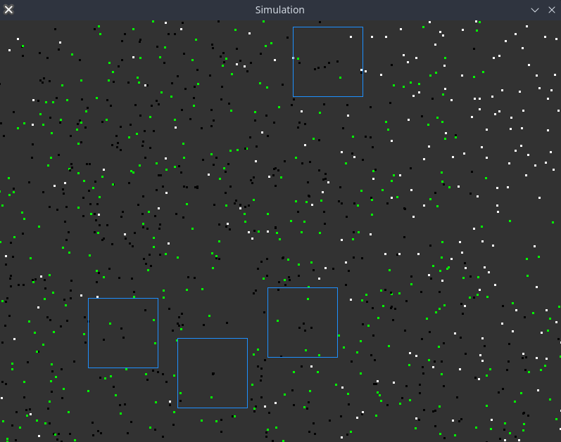
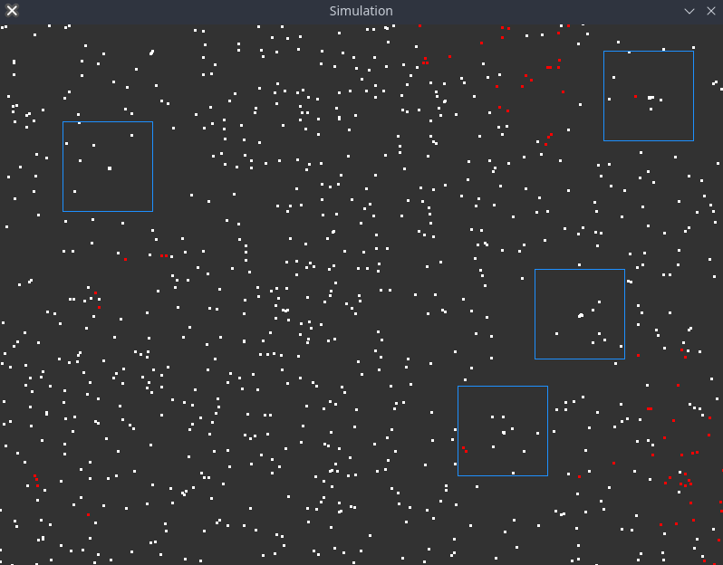
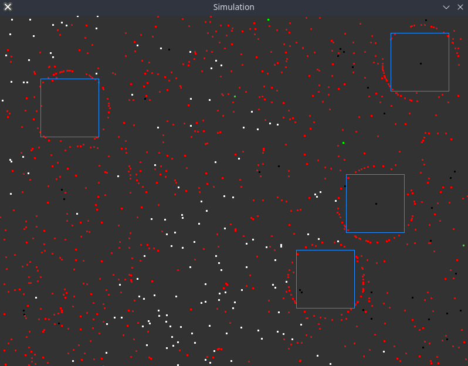

<h1 align="center">SpreadSimulator</h1>

<p align="center">
    
</div>
<p align="center">
Simulation of the spread and containment of infections
</p>
<br>

<p align="center">
    </img>
    </img>
</p>
<p align="center">
    </img>
    </img>
</p>


<h2 align="center">
    New
</h2>
<p align="center">
Complete rework in <b>Go</b>.
For the old C version, see the legacy zip file.
</p>

## Run
Requires https://github.com/veandco/go-sdl2
```
go build
./SpreadSimulator [options]
```
The following options are available;
1. -cfg [filame] | Choose a configuration by its filename, will use 'standard' if omitted
2. -v | Log current statistics in console
3. -export | Saves the statistics into the export directory as a CSV-File

<i> Example calls </i>
```
./SpreadSimulator -v
./SpreadSimulator -cfg customConfig -v
./SpreadSimulator -v -export
./SpreadSimulator -cfg customConfig -export
```


## TODO
1. ~~Config via JSON~~
2. ~~Statistics export using CSV~~
3. ~~CLI Options/Flags~~
4. R0 and Re
5. NoGUI option
6. (Live?) Visual Statistics
7. More Rendering Backends
8. ???
9. Profit

## How it works
The simulator creates a given number of entities within a confined space.  
Each of them is given a randomized motion vector, which is applied every tick.   
A number of them will be infected at the start.  
A number of them will be able to move around.  
If another entity passes within a given radius, it'll get infected by a certain probability.  
When an entity gets infected a timer will start. As soon as this timer runs out, the entity will either survive or die by a certain chance.  
The hospital capacity determines how many hospital slots are available to the infected.  
Each tick a number of random entities will be tested and detected using a certain probability. This simulates test accuracy.  
In the case of an entity getting a positive test result, the entity will be hospitalized, which means he will be immobile and its chance of survival rises to 90%.  
If active social distancing is set to true, the entities will actively try to avoid each other.
Randomly placed central locations attract entities during opening hours and repell them during closing time.
