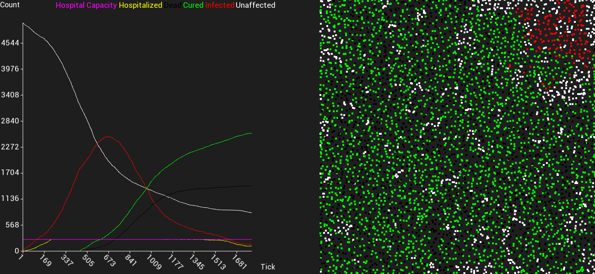

<h1 align="center">SpreadSimulator</h1>

<p align="center">
    
</div>

<br>

<p align="center">
A Simulation of the spread and containment of infections
</p>

<p align="center">
    
</div>

Image made in combination with [SFPlot](https://github.com/cherrysrc/SFPlot) and SFML

<h2 align="center">Newest version</h2>

<p align="center">
Completely rewrote original code to be more readable<br>
<b>Implemented Quadtree</b>  <br>
<br>Supports way larger amount of entities now<br>
Now support central locations people gather at
<br><br>
<i>Some function definitions and struct names changed, you might need to update your code</i>
</p>

<h2 align="center">How to use</h2>

Documentation can be found at: https://cherrysrc.github.io/SpreadSimulator/
Compile repo:
```
cmake .
make SpreadSimulation
./SpreadSimulation
```

Include Header:
```c
#include "SpreadSimulator/SpreadSimulator.h"
```
Create settings for your simulation:
```c
SimulationSettings settings = createSettings(
        1024,    /*entity count*/
        5,      /*initial infected*/
        850,    /*mobile entities*/
        200,    /*hospital capacity*/
        50,     /*tests per tick*/
        450,    /*ticks until healed/dead*/
        20,     /*chance of infection upon contact*/
        50,     /*chance of surviving*/
        50,     /*detection chance, chance of an infected being found upon testing*/
        5,      /*radius of influence (in pixels)*/
        true,   /*enable active distancing*/
        4,      /*amount of central locations*/
        600,    /*Area of movement width*/
        600);   /*Area of movement height*/
```
Or load an existing configuration:
```c
SimulationSettings settings = *loadSettings("settings.bin");
```

Create a SpreadSimulator:
```c
SpreadSimulator simulator = createSimulator(&settings);
```  
The values related to a probability should be between 0-100.  
Run the simulator by one step using
```c
tick(&simulator);
```
Running 120 ticks and logging the simulator values:
```c
for (int i = 0; i < 120; i++)
{
    printStats(&simulator);
    //Use function below in case you want to save the data into a file using
    // ./SpreadingSimulation > data.txt
    //It removes unnecessary descriptions and makes the resulting file easier to parse
    //printStatsRaw(simulator);
    tick(simulator);
}
```
Save your settings to a file for later use:
```c
saveSettings(&settings, "settings.bin");
```
You also have the option to save a more human-readable file:
```c
exportSettings(&settings, "exportSettings.txt");
```
Dont forget to free afterwards to avoid memory leaks
```c
cleanup(&simulator);
```
## How it works
In the following text the phrase within parenthesis will be a reference to above code snippets comments.  
The simulator creates a given number of entities(samples) within a confined space(Area of movement).  
Each of them is given a randomized motion vector, which is added to their position every tick.   
A number of them will be infected at the start(initial infected).  
A number of them will be able to move around(mobile entities).
If another entity passes within a given radius(radius of influence in pixels), it'll get infected by a certain probability(chance of infection upon contact).  
When an entity gets infected a timer will start. As soon as this timer runs out, the entity will either survive or die by a certain percentage(chance of surviving).  
The hospital capacity(hospital capacity) determines how many hospital slots are available to the infected.  
Each tick a number of random entities(tests per tick) will be tested and detected using a certain probability(detection chance).  
In the case of an entity getting a positive test result, meaning he will be hospitalized, he won't be able to move anymore and its chance of surviving is set to 90%.
If active social distancing is set to true, the entities will try actively try to avoid each other.
Randomly placed central locations attract entities during opening hours and repell them during closing time.
